> 레시피 기반 가격 비교 사이트 '쿡쿡'

## 💠 기획 계기

최근 인기 프로그램인 ‘흑백요리사’를 알고 계실텐데요, ‘흑백요리사’가 방영된 이후 요리에 입문하는 사람과 새로운 요리를 시도 하려는 사람들이 많아졌습니다.

하지만 현실적으로 **바쁜 현대인들**은 요리에 필요한 식재료를 하나하나 준비하거나 관리할 여유가 부족합니다.

이를 통해서 저희는 **요리에 입문하는 사람들과** **바쁜 현대인**들이 손쉽게 요리를 시작하고, 

효율적으로 재료를 관리하며 필요한 재료를 빠르게 준비할 수 있는 사이트의 필요성을 느끼게 되었습니다.

 

## 🧑‍🍳 서비스 소개

**쿡쿡**의 주요 기능으로는 다음과 같습니다:

- **나만의 냉장고**: 사용자가 자신의 식재료를 관리할 수 있습니다.
- **레시피 검색**: 재료나 요리 이름 기반으로 레시피 검색이 가능합니다.
- **맞춤 레시피**: 선호도를 설정하면 선호도 우선 레시피가 나열됩니다.
- **상품 가격 비교**: 검색한 상품의 가격 비교를 그래프를 통해 제공합니다.

이러한 기능들을 통해 냉장고 속 재료를 효율적으로 관리하고, 부족한 재료는 상품 가격 비교와 온라인 구매 연계를 통해 경제적으로 준비할 수 있도록 돕습니다.

 

## 📆 개발 기간

### 2024.09.20 ~ 2024.11.27 (9주)

 

## 🧑‍🤝‍🧑 팀 구성

<table>
  <tr >
    <td align="center" width="200px" >
      
    </td>
    <td align="center" width="200px" >
      
    </td>
    <td align="center" width="200px" >
      
    </td>
    <td align="center" width="200px" >
      
    </td>
    <td align="center" width="200px" >
      
    </td>
    <td align="center" width="200px" >
      
    </td>
  </tr>
  <tr>
    <td align="center" width="200px" >
      <a href="https://github.com/parkbg-git/"><strong>박병규</strong></a> Full Stack
    </td>
    <td align="center" width="200px" >
      <a href="https://github.com/maybeaj/"><strong>이효진</strong></a> Full Stack
    </td>
    <td align="center" width="200px" >
      <a href="https://github.com/dacapotrip/"><strong>추상우</strong></a> Full Stack
    </td>
    <td align="center" width="200px" >
      <a href="https://github.com/Gyunie01/"><strong>정창균</strong></a> Frontend
    </td>
    <td align="center" width="200px" >
      <a href="https://github.com/cukwak/"><strong>유현빈</strong></a> Backend
    </td>
    <td align="center" width="200px" >
      <a href="https://github.com/JBPineneedle/"><strong>유용찬</strong></a> DB
    </td>
  </tr>
</table>
 

 

## 🛠️ 기술 스택

- 
  
  
  
- 
  
  
  
- 
   
  

- 
  

- 
   
  

- 
  
  
   
  

 

## 📁 ERD

 

## 🚀 서비스 아키텍처

 

## 주요 기능

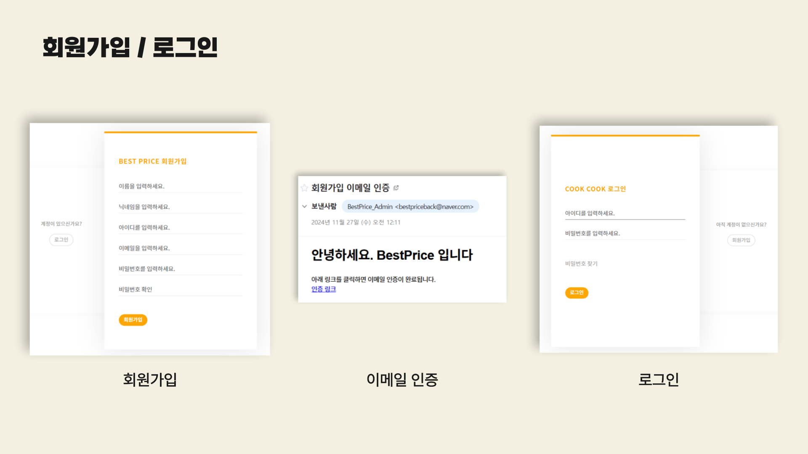
 

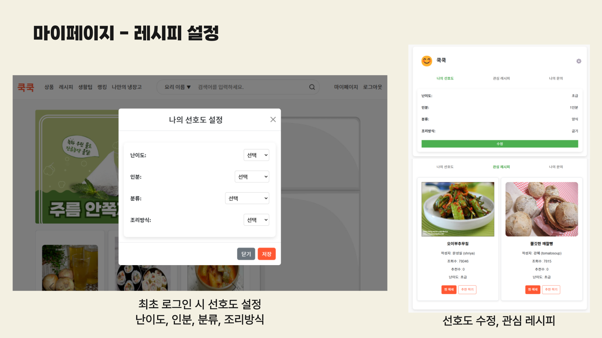
 

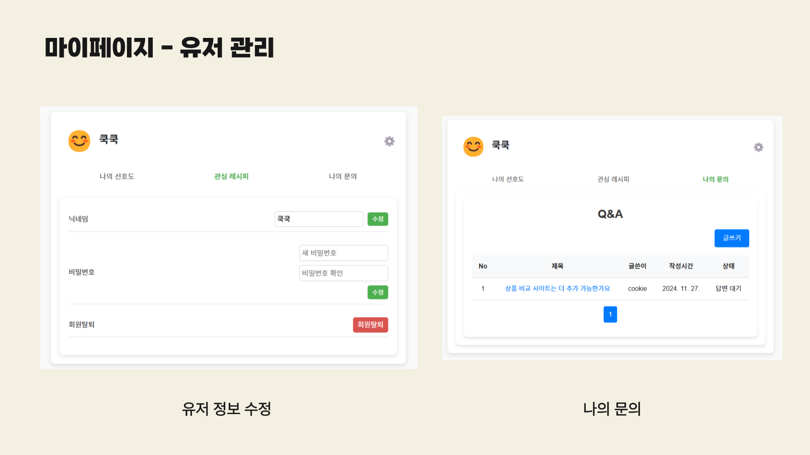
 

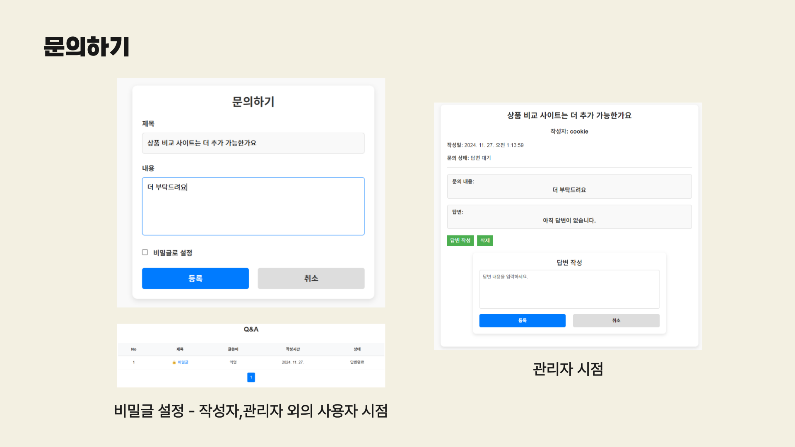
 

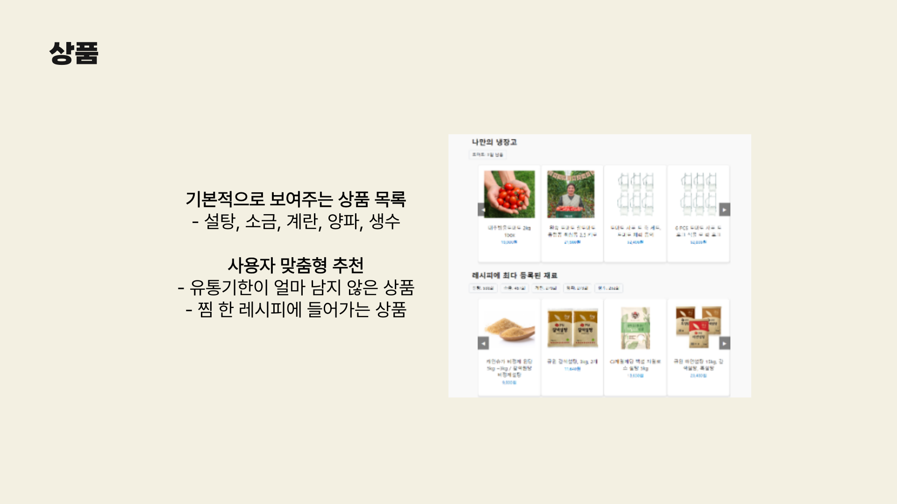
 

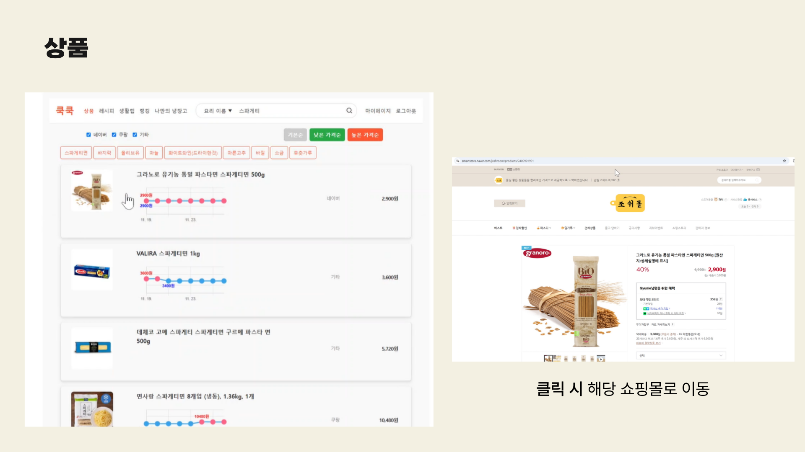
 

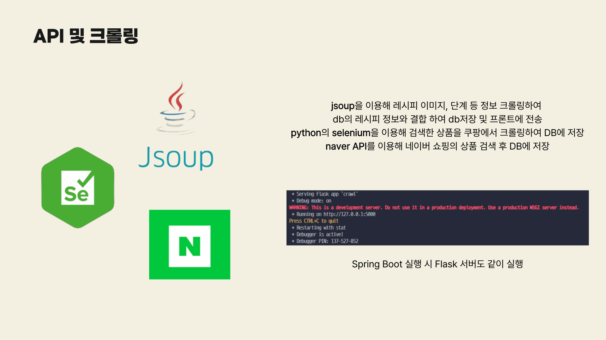
 

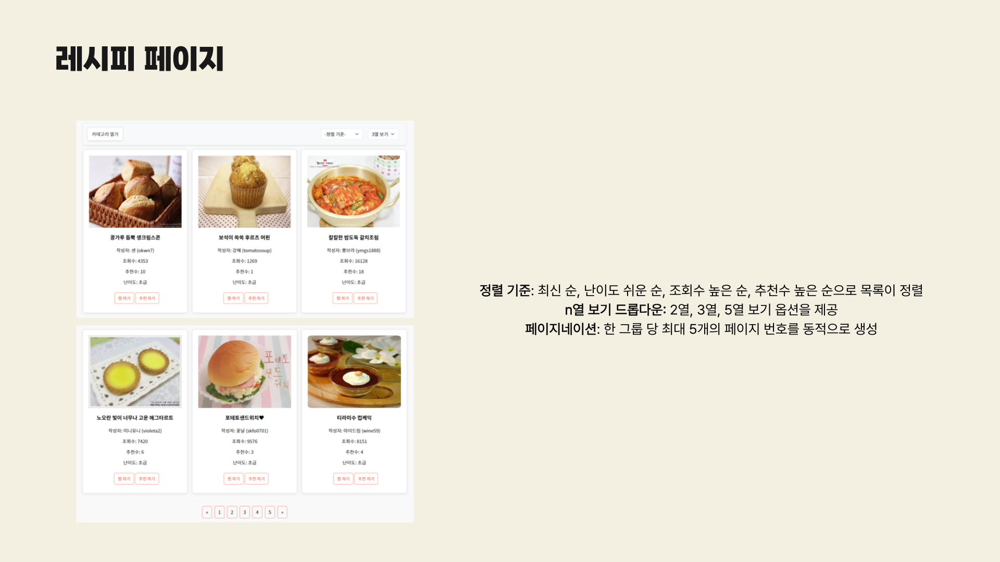
 

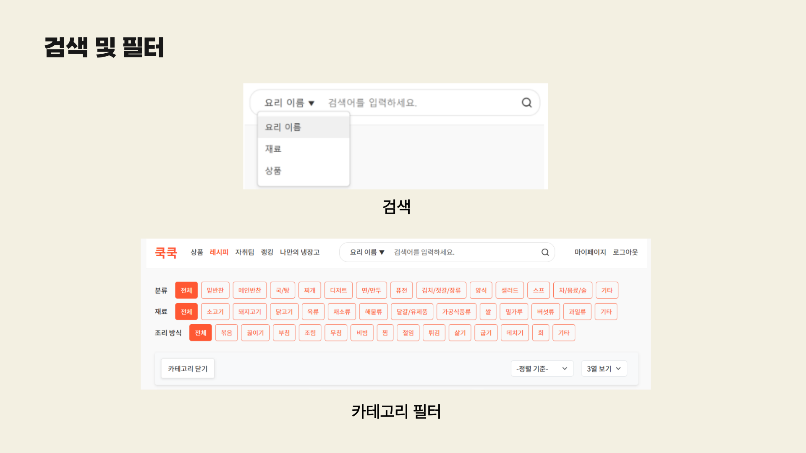
 

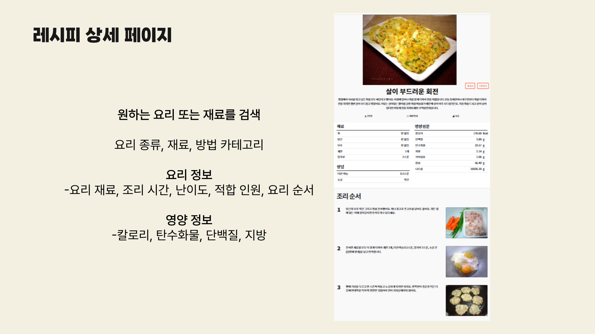
 

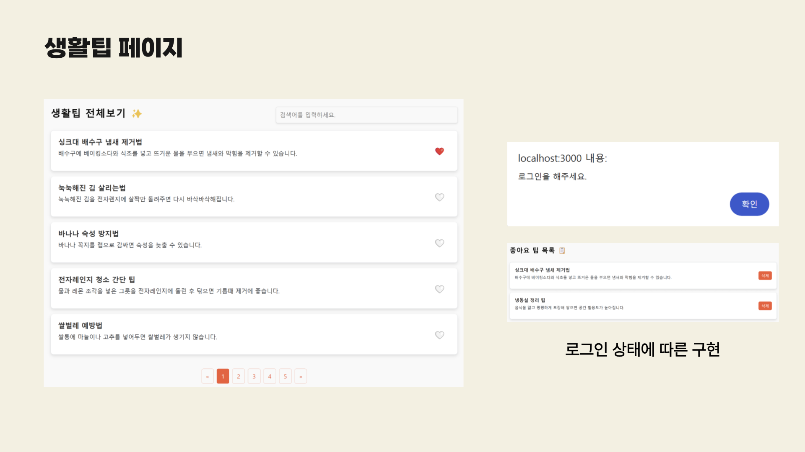
 

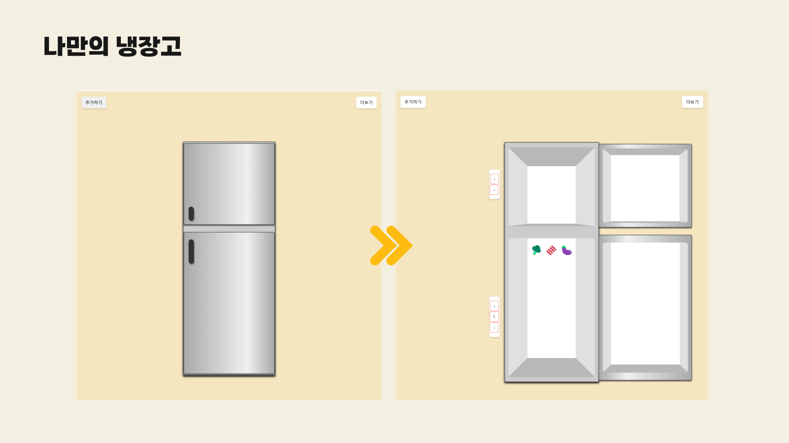
 

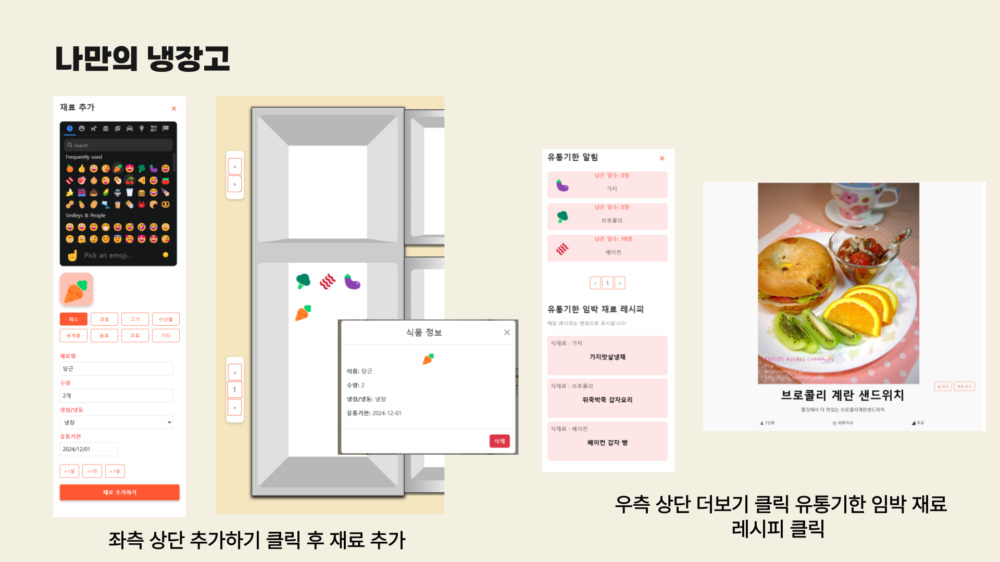
 

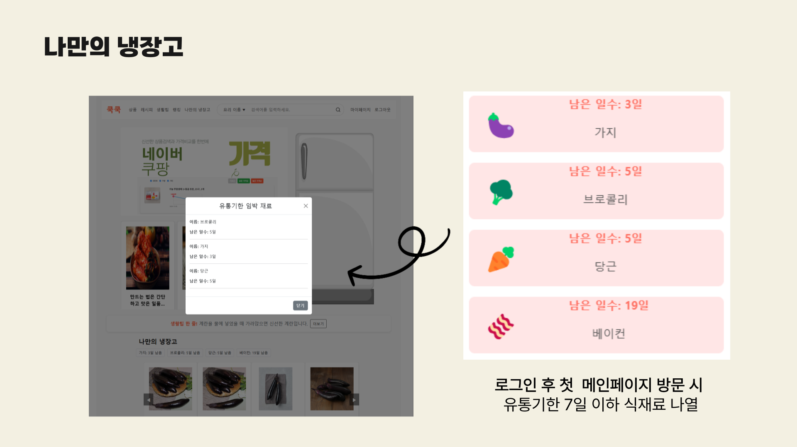
 

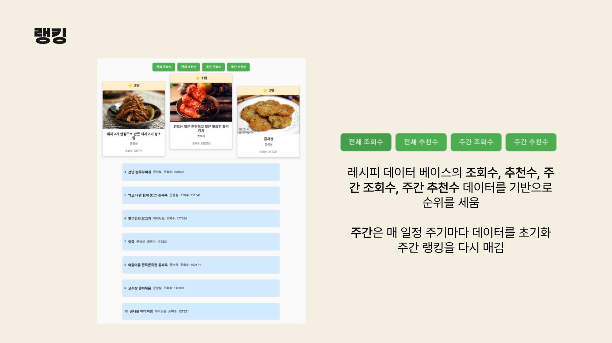
 

